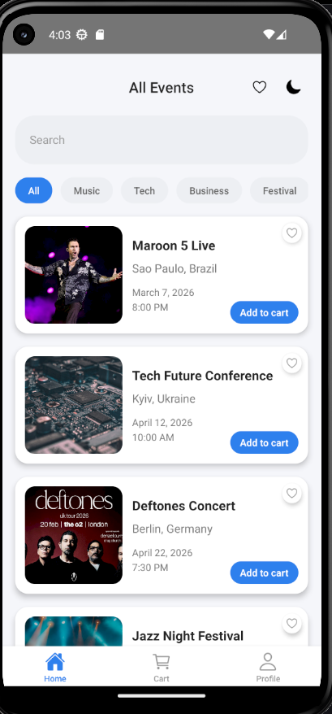
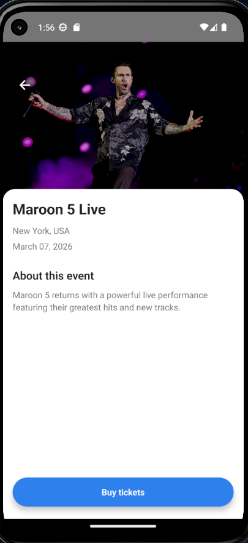
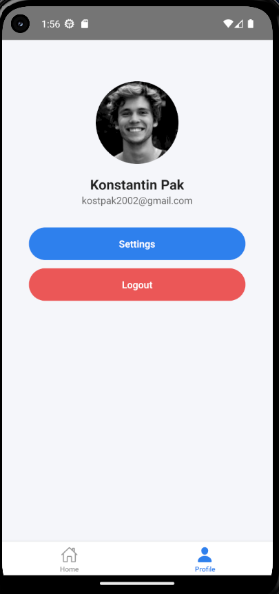
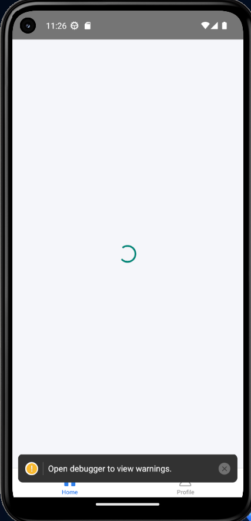

# Event App

## Components:

* Header
* SearchInput
* CategoryList
* CategoryChip
* EventCard
* BottomNav
* DetailsScreen
* ProfileScreen

## Features:

* Navigation between screens
* Event list
* Event details screen
* Profile screen

## Screenshots





# Cross Assignment 4 — Navigation

##  Опис

Мобільний застосунок на React Native з реалізованою навігацією.
Реалізовано Stack та Tab навігацію, додано переходи між екранами та передачу даних через navigation.navigate і route.params.
---

##  Навігація

- Stack Navigation:
  - Home → Details

- Tab Navigation:
  - Home
  - Profile

---

##  Передача даних

Перехід на екран деталей з передачею об'єкта:

```js
navigation.navigate('Details', { event });

Отримання даних:

const event = route.params?.event;
```

---

# Cross Assignment 5 - API Integration

##  Опис

У цьому завданні було реалізовано інтеграцію зовнішнього API у застосунок.

Дані про події завантажуються з MockAPI та відображаються у списку на головному екрані.

---

##  API

Використано MockAPI:

https://6a03cd842afe8349b4b58220.mockapi.io/events

---

##  Реалізація

### Запит до API

Логіка винесена в окремий файл:

```js
export const fetchEvents = async () => {
  const response = await fetch(API_URL);

  if (!response.ok) {
    throw new Error('API error');
  }

  return response.json();
};
```

---

### Робота зі станом

```js
const [events, setEvents] = useState([]);
const [loading, setLoading] = useState(true);
const [error, setError] = useState('');
```

---

### Завантаження даних

```js
useEffect(() => {
  fetchEvents()
    .then(data => setEvents(data))
    .catch(() => setError('Failed to load events'))
    .finally(() => setLoading(false));
}, []);
```

---

##  Відображення списку

Використано FlatList та компонент EventCard:

```js
<FlatList
  data={events}
  renderItem={({ item }) => <EventCard {...item} />}
  keyExtractor={item => item.id.toString()}
/>
```

---

##  Loading

Під час завантаження відображається:

```js
<ActivityIndicator />
```

---

##  Обробка помилок

При помилці API:

```js
<Text>Failed to load events</Text>
```

---

##  Інтеграція з навігацією

При натисканні на подію відкривається екран деталей:

```js
navigation.navigate('Details', { event });
```

---

##  Додаткові скріншоти



