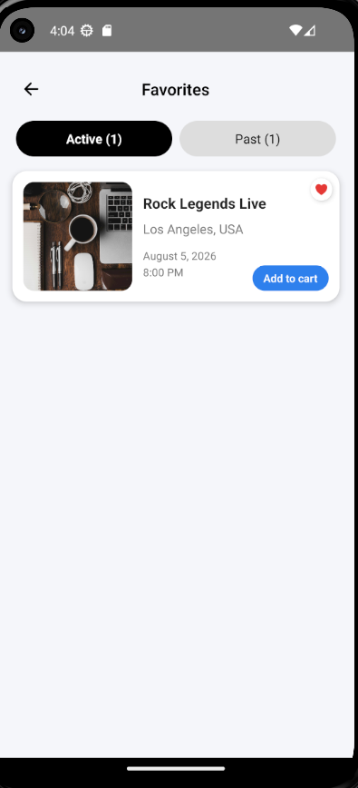
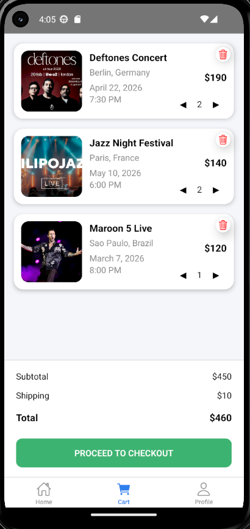
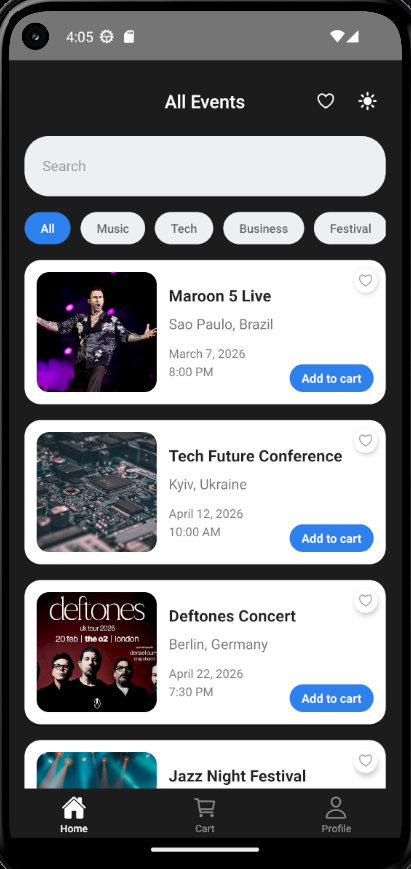

# Pak_cross_final_project

## Опис проєкту

Цей проєкт є мобільним застосунком для перегляду та придбання квитків на події.  
Застосунок було розширено та покращено на основі базової версії з акцентом на зручність користування, сучасний інтерфейс та додаткову функціональність.

Метою проєкту було не створення застосунку з нуля, а підвищення якості вже існуючого продукту.

---

## Основний функціонал

- Список подій із базовою інформацією
- Екран деталей події з розширеним описом
- Пошук подій за назвою та локацією
- Фільтрація за категоріями
- Обране з поділом на активні та завершені події
- Кошик із керуванням кількістю квитків
- Функція "Купити зараз" із переходом у кошик
- Підтримка світлої та темної теми
- Обробка помилок API

---

## Структура застосунку

Застосунок побудований за компонентним підходом із чітким розділенням логіки:

- Екрани: Home, Details, Favorites, Cart
- Компоненти: EventCard, SearchInput, CategoryList, CartItem, Header
- Управління станом:
  - Context API - тема
  - Redux Toolkit - кошик та обране

---

## Управління станом

Використано два підходи:

Context API:
- для керування темою (light/dark)
- простий глобальний стан

Redux Toolkit:
- для кошика (додавання, видалення, кількість)
- для обраного (логіка фільтрації, збереження)

Такий підхід забезпечує масштабованість та зручність підтримки.

---

## Робота з API

Застосунок використовує локальний JSON API для отримання подій.

Було реалізовано:

- обробку помилок через try/catch
- перевірку структури відповіді
- обробку випадків:
  - відсутність інтернету
  - помилки сервера (404 / 500)
  - некоректні дані
- зрозумілі повідомлення про помилки

---

## Покращення UX/UI

Було значно покращено взаємодію користувача із застосунком:

- реалізовано пошук у реальному часі
- об’єднано пошук і фільтрацію за категоріями
- покращено навігацію між екранами
- додано нижню панель дій на екрані деталей
- реалізовано блок додаткової інформації про подію
- забезпечено узгодженість дизайну між екранами
- повна підтримка темної теми

---

## Екран деталей події

Екран містить:

- форматовану дату і час
- розширений опис події
- додаткову інформацію:
  - місце проведення (venue)
  - тривалість (duration)
  - вікові обмеження (age)
  - інформацію про квитки (tickets)

Також додано:

- кнопку "Додати в кошик"
- кнопку "Купити зараз" з переходом у кошик

---

## Функціонал кошика

Реалізовано:

- зміну кількості квитків
- автоматичний підрахунок вартості
- subtotal, shipping, total
- доставка враховується тільки якщо кошик не пустий
- можливість видалення товару

---

## Функціонал обраного

Реалізовано:

- поділ на активні та завершені події
- автоматичну фільтрацію за датою
- блокування взаємодії для завершених подій
- візуальне позначення недоступних подій

---

## Скріншоти

### Головний екран

### Екран деталей події

### Екран обраного

### Екран кошика

### Темна тема

---

## Використані технології

- React Native
- TypeScript
- Redux Toolkit
- React Navigation

---

## Висновок

Застосунок було успішно покращено з базової версії до більш повноцінного продукту.

Основні покращення:

- розширений функціонал
- покращений користувацький досвід
- оптимізована структура коду
- сучасний та узгоджений інтерфейс

Фінальний результат - зручний, масштабований та функціональний мобільний застосунок.